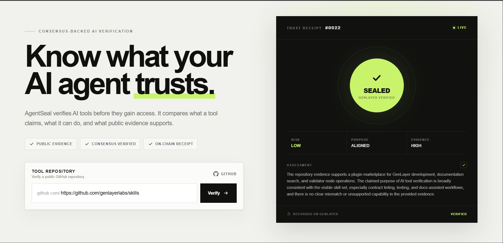
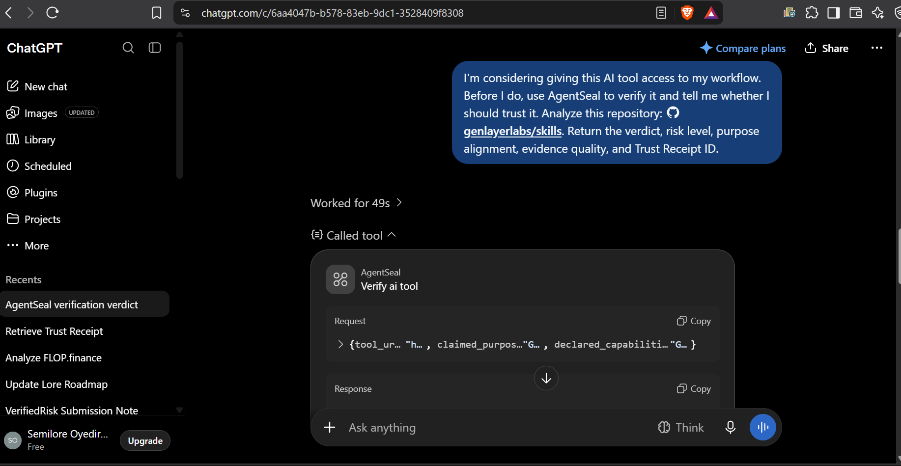
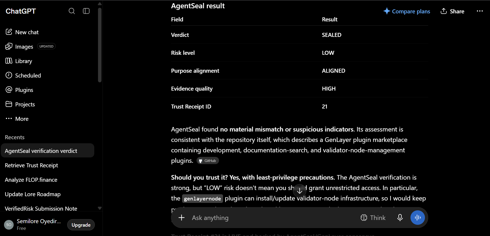
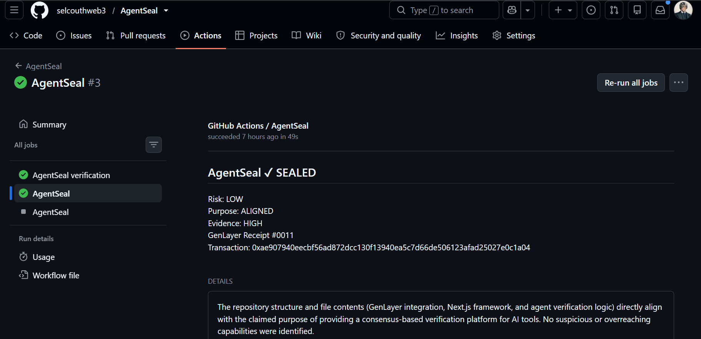

# AgentSeal

**Trust infrastructure for AI agents.**

AgentSeal verifies AI tools before agents use them. It checks what a tool claims, what it can do, and what public evidence supports it, then uses GenLayer consensus to produce a Trust Receipt.

[Live App](https://agent-seal-rouge.vercel.app) · [Demo Video](https://youtu.be/vv48acA1yvs) · [GitHub](https://github.com/selcouthweb3/AgentSeal)

## Product

AgentSeal gives developers a way to verify an AI tool before giving it access.

## ChatGPT integration

AgentSeal can be called directly from ChatGPT through MCP. The assistant sends the tool repository and the information needed for verification.

The verification returns the verdict, risk level, purpose alignment, evidence quality, and Trust Receipt ID.

## GitHub integration

AgentSeal can also run as part of a GitHub Actions workflow. The verification result is published back to the repository as a GitHub Check.

## How it works

A GitHub repository is submitted to AgentSeal for verification. AgentSeal evaluates the repository evidence and sends the assessment through GenLayer consensus. A successful assessment produces a Trust Receipt that can be retrieved later.

GitHub repository
       ↓
AgentSeal
       ↓
Evidence assessment
       ↓
GenLayer consensus
       ↓
Trust Receipt
       ↓
AI agent / developer

## Links

- [Live App](https://agent-seal-rouge.vercel.app)
- [Demo Video](https://youtu.be/vv48acA1yvs)
- [GitHub Repository](https://github.com/selcouthweb3/AgentSeal)
